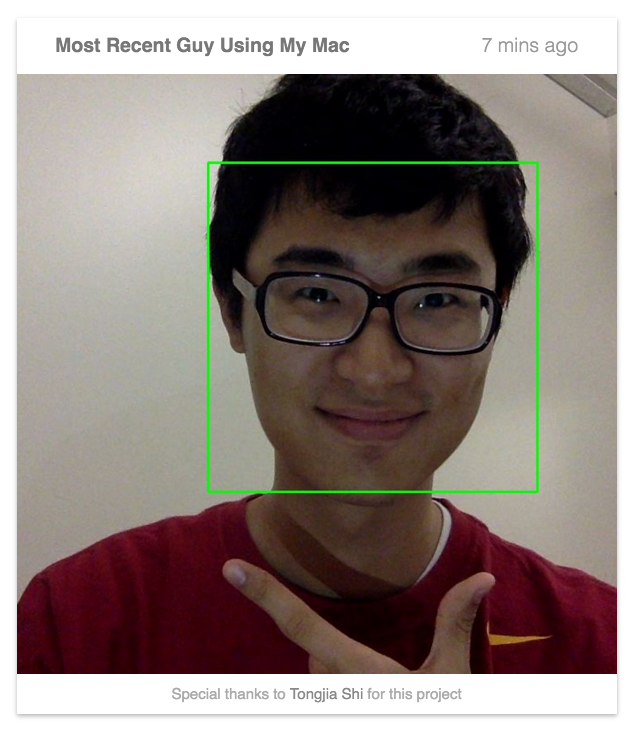
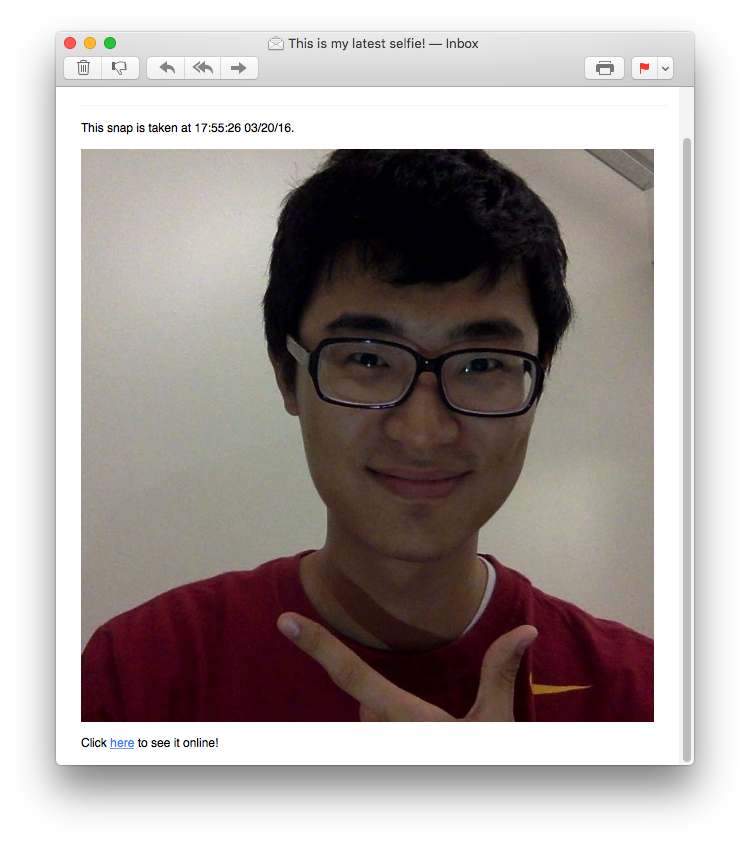

# Snap (Most recent guy using my Mac)

*This project is for my mom for her missing me and wanna see my face.* ❤️

Click [here](http://www-scf.usc.edu/~yankuanz/snap/) to see the **Most recent guy using my Mac**.

## Capture Images
This project works with [Snoop Catcher](https://itunes.apple.com/us/app/snoop-catcher/id987378024?mt=12) (by MacDaddy), which captures images when Mac lid is opened.

## Detect Faces
It detects faces with **Haar Feature-based Cascade Classifiers** in OpenCV with following parameters (which have been tested for performance):

-  `scaleFactor`: 1.025
-  `minNeighbors`: 3
-  `minSize`: 30 x 30

## Send Emails
On Mar 18, my VIP user, AKA my dear mom, complained to me about the webpage loading really slow, and I assume this is because the server and the user are *kinda* across the Pacific. So I added the functionality of sending emails in script.

What I used is the command `mail` with `uuencode` to attach the image:
	
	os.system('(echo "%s"; uuencode %s "%s") | mail -s "%s" %s' % ("This snap is taken at " + time.strftime('%X %x') + '.\n', os.path.join(SCRIPT_DIR, imageFileName), imageFileName, SUBJECT, RECEIVER))  
	
And a `RECEIVER` will get something like:

## Self-terminate
The application will self-terminate (uhh, there must be a better word) in **a week** from the moment it starts to run. I just feel like it is the right thing to this.

## Acknowledgement 
A million thanks to **Tongjia Shi** for his building the ground code
